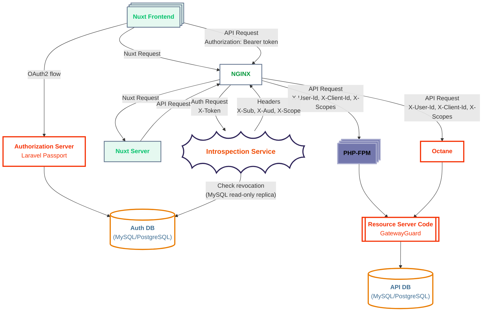
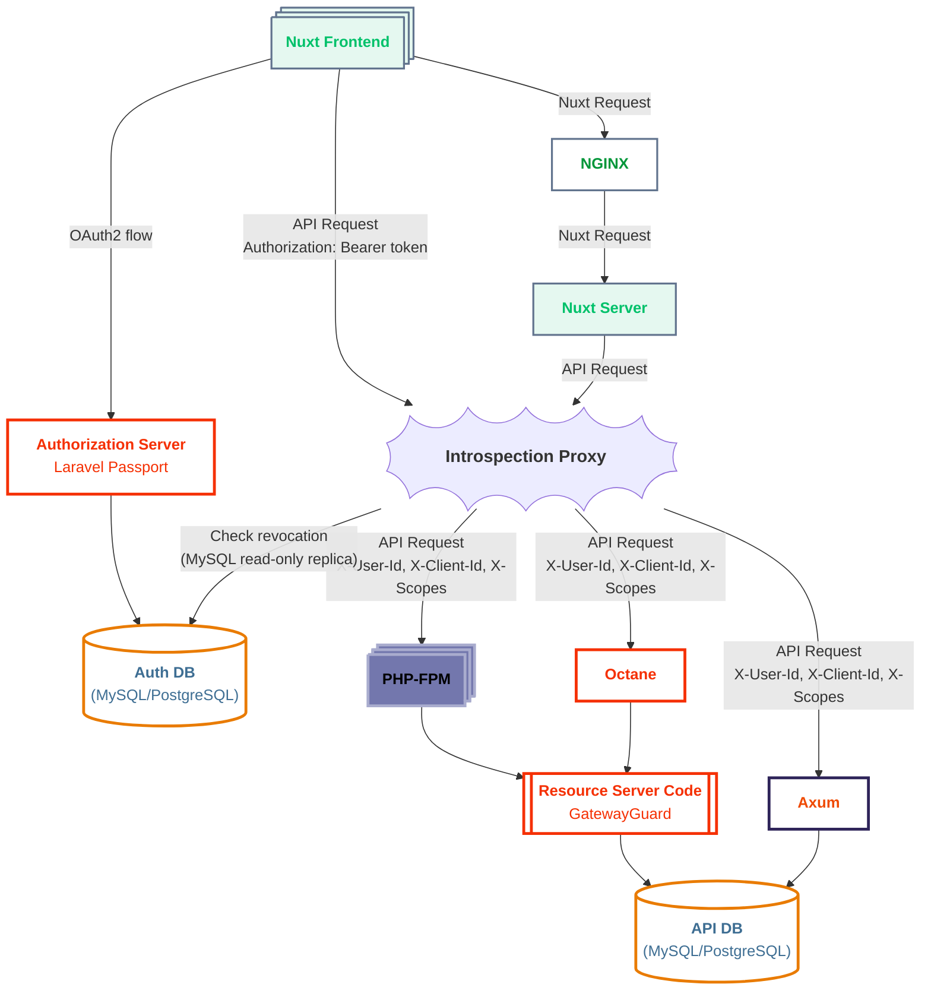

# Laravel Passport Access Token Introspection

- Validates JWT Tokens (Claims) the same way as Laravel Passport (League OAuth)
- Connects to the Laravel Passport Database and checks Token Meta info (`is_revoked`)

See 2015 OAuth 2.0 Token Introspection <https://datatracker.ietf.org/doc/html/rfc7662>

[Why?](https://gist.github.com/ulcuber/7b098e5e9d5e3cd106aeefbafb950974)



## Performance

- ~107-136k RPS for self
- ~2.1k RPS NGINX { `auth_request` + Octane (2.6k RPS self) }

See [Benchmarking Results](https://github.com/ulcuber/laravel-passport-introspection/blob/main/docs/benchmark-results.md) for more info

HTTP only non-RFC (`/introspect-http`) is faster and has twice less bandwidth. It is the only way to for NGINX `auth_request` to work

`EdDSA` provides more modern security while having shorter (256bit versus 2048bit) key (+15% RPS with DB, +41% without DB for non-cached introspector itself). It can also speed up access tokens generation. Also smaller signature and smaller JWT. Requires additional Laravel configuration from the start

# Run

Copy `.env.example` to `.env` and configure

```bash
cargo run --release
```

It will serve on `http://localhost:8080` this routes:

- POST `/introspect` - RFC compliant. Request: `application/x-www-form-urlencoded`. Response: metadata in JSON body `{"active": true,...claims...}`
- POST `/introspect-json` - Request: `application/json`. Response: metadata in JSON body `{"active": true,...claims...}`
- GET `/introspect-http` - Request: `X-Token` header. Response: no body, only headers `X-Sub`, `X-Aud`, `X-Scope` for easy nginx `auth_request`

Check `./scripts/curl_env.sh`

# Settings

You might want to configure read-only replica or user with read-only permissions to `oauth_access_tokens table` of the **Authorization Server**

### MySQL/MariaDB

Check `./scripts/mysql_monitor.sh`

Add at least `DATABASE_MAX_CONNECTIONS` + 1 to `/etc/my.cnf.d/90-user.cnf`:

```conf
[mysqld]
max_connections=200
max_user_connections=200
```

### `JWT_ALGORITHM`

To set for example `JWT_ALGORITHM=EdDSA` you will need to generate key pair

```bash
openssl genpkey -algorithm ed25519 -out ed25519_private_key.pem
openssl pkey -in ed25519_private_key.pem -pubout -out ed25519_public_key.pem
```

Then set path to the key:

```dotenv
JWT_PUBLIC_KEY_PATH="ed25519_public_key.pem"
```

# Integration

## Gateway/Proxy

### Nginx

Example Nuxt Dev config with `/api/slots/` as PHP FPM service:

[/etc/nginx/conf.d/slots.conf](https://github.com/ulcuber/laravel-passport-introspection/tree/main/examples/nginx-slots.conf)

### Ingress/Kubernetes

Planned

### Traefik

Planned

### HAProxy

Planned

## Resource Server

Generally any service whether PHP (Laravel) or not can read `X-Gateway-Secret` and `X-Client-Id` headers

`config/auth.php`:

```php
<?php

return [
    // ...
    'guards' => [
        // ...
        'gateway' => [
            'driver' => 'gateway',
            'provider' => 'users-factory',
            'secret' => env('GATEWAY_SECRET'),
            'client_ids' => [env('CLIENT_ID')],
            'auth_header_key' => 'X-Gateway-Secret',
            'user_header_key' => 'X-User-Id',
            'client_header_key' => 'X-Client-Id',
            'storage_key' => 'id',
        ],
        // ...
    ],
    'providers' => [
        // ...
        'users-factory' => [
            'driver' => 'eloquent-factory',
            'model' => env('AUTH_MODEL', User::class),
        ],
        // ...
    ],
    // ...
];
```

See implementation used in benchmarks:

<https://github.com/ulcuber/laravel-slots/tree/main/app/Auth>

And like so, zero heavy cryptography in PHP

# Unix sockets introspector

The same features without TCP and HTTP overhead for using inside of microservice container

Or HTTP over sockets to bypass network stack

## Settings

Check `ulimit -n`

You may need to edit `/etc/security/limits.conf`:

```conf
* soft nofile 65536
* hard nofile 65536
```

`/etc/rc.conf`:

```conf
rc_ulimit="-n 65536"
```

## Run

```bash
cargo run --release --bin introspection_socketsd --features sockets
cargo run --release --bin introspection_http_socketsd --features sockets
```

## Integration

### No HTTP

See:
- [examples/sockets_introspect.php](https://github.com/ulcuber/laravel-passport-introspection/tree/main/examples/sockets_introspect.php)
- [examples/sockets_benchmark.rs](https://github.com/ulcuber/laravel-passport-introspection/tree/main/examples/sockets_benchmark.rs)

```bash
php examples/sockets_introspect.php
```

### HTTP over sockets

Can be used in nginx too via `server unix:/run/introspector.sock`

# Proxy introspector



## Configure prefixes

`proxy.toml`:

```toml
[[routes]]
prefix = "/api/slots/"
target = "http://localhost:8081/slots/"
strip_prefix = true

[[routes]]
prefix = "/api/orders/"
target = "http://localhost:8082/"
strip_prefix = false
```

## Run

```bash
cargo run --release --bin proxy --features proxy
```

# Mono-Proxy introspector

For using inside microservice pod

```dotenv
MONO_PROXY_TARGET=http://localhost
```

```bash
cargo run --release --bin mono_proxy --features proxy
```

# As Library for Rust microservices

```bash
cargo add laravel-passport-introspection --git https://github.com/ulcuber/laravel-passport-introspection --tag v0.2.0
```

See example:

<https://github.com/ulcuber/axum-slots/blob/383fc661000ba89612d03672a533866615483fe0/src/app.rs#L40>
